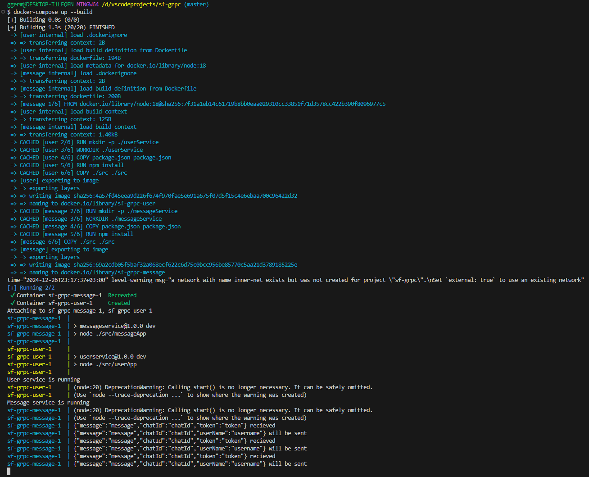
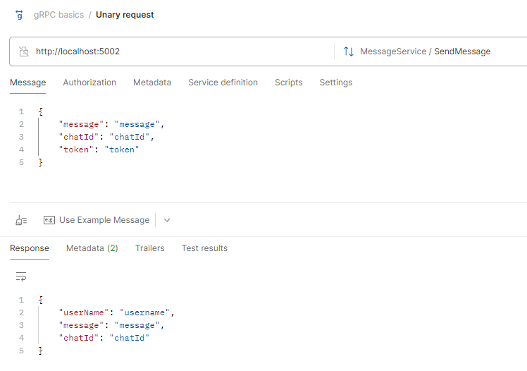

# Проектирование микросервисной архитектуры

## Выбор системы

Система для проектирования - социальаня сеть.

## Список ключевых функицй

- Аутентификация
- Настройка личного профиля
- Публикация и просмотр новостей
- Отправка сообщений
- Создание групп и сообществ

## Список независимых модулей

- Работа с пользователями
- Работа с сообщениями
- Работа с новостной лентой
- Работа с группами и сообществами 

## Выделение микросервисов

> Создайте два микросервиса, которые решают определнную задачу

Были выбраны:

- Микросервис для работы с пользователями
- Микросервис для работы с сообщениями

## Определение интерфейсов взаимодействия

### [userService.proto](./services/userService/src/user.proto)

Предусмотрен следующий функционал:

- Создание аккаунта
- Вход в аккаунт
- Редактирование профиля
- Получение данных текущего пользователя
- Получение списка друзей
- Получение списка пользователей
- Добавление в друзья

### [messageService.proto](./services/messageService/src/message.proto)

Предусмотрен следующий функционал:

- Отправка сообщения
- Получение списка сообщений
- Создание чата
- Получение списка чатов


## Настройка инфраструктуры с Docker

- [userService Dockerfile](services/userService/Dockerfile)
- [messageService Dockerfile](services/messageService/Dockerfile)
- [docker-compose.yaml](./docker-compose.yaml)

## Развертывание и тестирование

```
docker-compose up --build
```

Для демонстрации функционала был реализован mock-запрос на отправку сообщения. MessageService получает запрос SendMessage(token, message, chatId). В свою очередь, MessageService вызывает userService, чтобы по токену получить имя пользователя, отправившего сообщение. В результате, MessageService возвращает ответ формата (userName, message, chatId)

- [Реализация UserService](./services/userService/src/userApp.js)
- [Реализация MessageService](./services/messageService/src/messageApp.js)
- [Реализация UserClient](./services/messageService/src/userClient.js)



